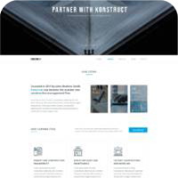

# Training projects

| Automotive [Page](https://rodionnest.github.io/Automotive/) / [Repo](https://github.com/rodionnest/Automotive)| Konstruct [Page](https://rodionnest.github.io/Konstruct/) / [Repo](https://github.com/rodionnest/Konstruct)|
| ----------- | ----------- |
|  |  |
|   |        |
